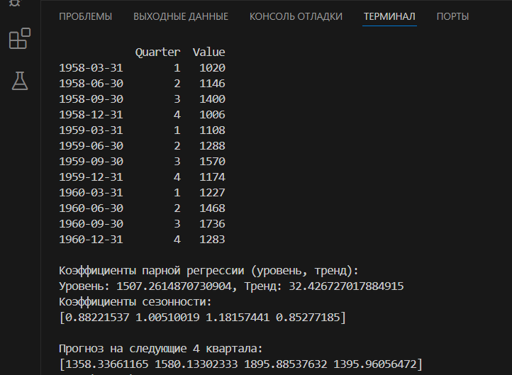

# lb_im_6
## Цель работы 
Реализовать на языке программирования Python модель Хольта-Уинтерса без использования библиотек данной модели.
## Постановка задачи
На входе программа принимает временной ряд и параметры сглаживания. 

На выходе программа должна выдавать параметры модели Хольта-Уинтерса (коэффициенты парной регрессии и коэффициенты сезонности) и прогноз на один или большее число периодов (в зависимости от длины временного ряда: три периода или более - один прогнозный период, семь периодов или более - два периода прогноза). 
## Краткое описание модели
Программа получает данные о пассажирских авиаперевозках из встроенного набора данных AirPassengers, который предоставляется библиотекой statsmodels. Параметры сглаживания ```alpha```, ```beta``` и ```gamma``` заданы в коде. 

Мультипликативная модель Хольта-Уинтерса реализуется в функции ```holt_winters```. Начальные значения для уровня ```level```, тренда ```trend``` и сезонности ```seasonal``` инициализируются на основе первых значений временного ряда ```ts```. Далее применяется алгоритм Хольта-Уинтерса и строится прогноз. Функция возвращает прогноз, соответствующий заданному в коде прогнозному периоду в 4 квартала, коэффициенты парной регрессии и коэффициенты сезонности ```level, trend, seasonal, forecast```.
## Результат работы программы


